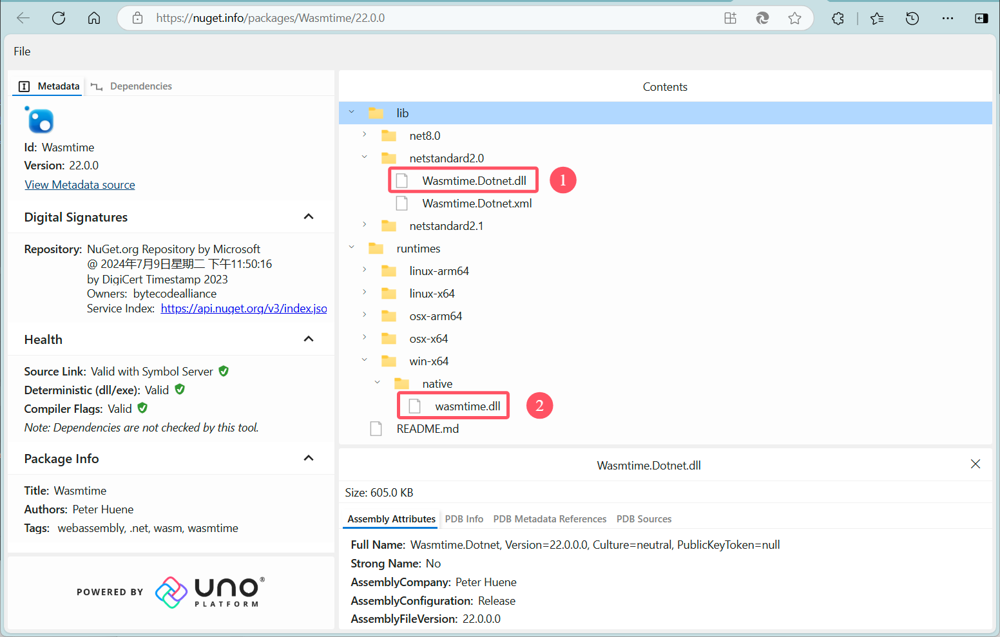
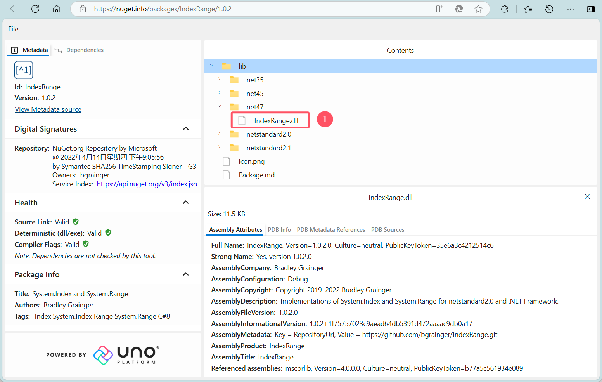

# ResoniteWasm

A [ResoniteModLoader](https://github.com/resonite-modding-group/ResoniteModLoader) mod
for [Resonite](https://resonite.com/) that does something.
<!-- Edit to describe what your mod does and what it may solve -->
<!-- If your mod solves an issue, you should link to any relevant issues on the resonite github -->

**I haven't written this README.md yet**

## References

Here's the code I referenced or copied into the project

[Wasmtime](https://github.com/bytecodealliance/wasmtime)  
[Wasmtime .NET](https://github.com/bytecodealliance/wasmtime-dotnet)

## Screenshots

<!-- If your mod has visible effects in the game, attach some images or video of it in-use here! Otherwise remove this section -->

## Installation

1. Install [ResoniteModLoader](https://github.com/resonite-modding-group/ResoniteModLoader).
2. Place [ResoniteWasm.dll](https://github.com/YourGithubUsername/YourModRepoName/releases/latest/download/ResoniteWasmName.dll) into your `rml_mods` folder.  
   This folder should be at `C:\Program Files (x86)\Steam\steamapps\common\Resonite\rml_mods` for a default install.  
   You can create it if it's missing, or if you launch the game once with ResoniteModLoader
   installed it will create this folder for you.
3. Go to Nuget and [download the two required dlls](https://nuget.info/packages/Wasmtime/22.0.0) and place them in the
   `rml_libs` folder.  
   This folder should be at `C:\Program Files (x86)\Steam\steamapps\common\Resonite\rml_libs`  
   You can double-click the file name to download it.
   
4. Go to Nuget and [download the other dll](https://nuget.info/packages/IndexRange/1.0.2) and place again.
   

5. Start the game. If you want to verify that the mod is working you can check your Resonite logs.
